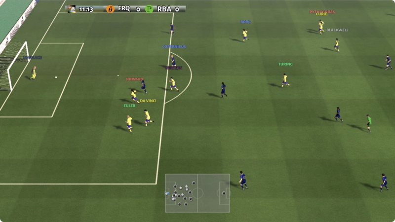
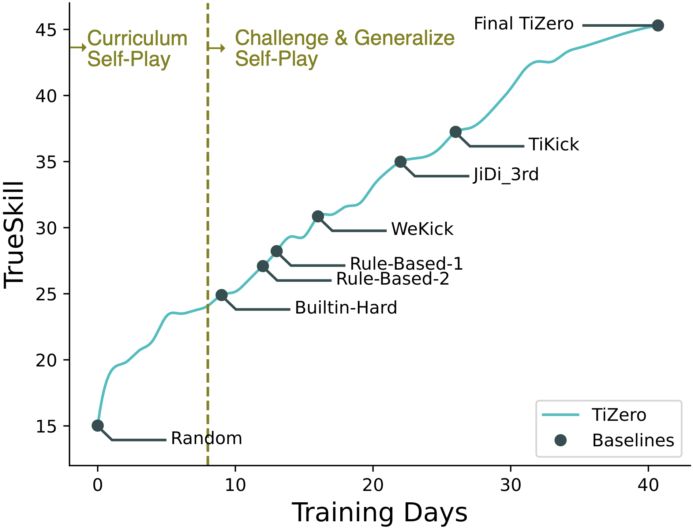
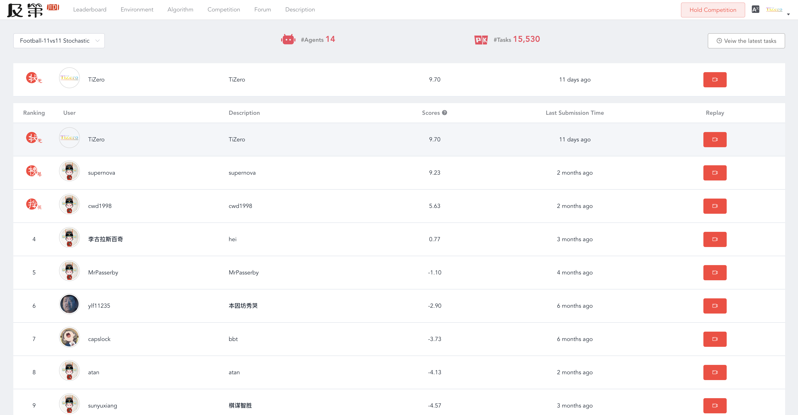

<div align="center">

</div>

<div align="center">

</div>

[](https://opensource.org/licenses/Apache-2.0)
[](https://pypi.org/project/tizero/)

[](https://tizero.readthedocs.io/en/latest/?badge=latest)


### Introduction

Reinforcement learning agent for Google Research Football.

Code accompanying the paper 
"TiZero: Mastering Multi-Agent Football with Curriculum Learning and Self-Play" (AAMAS 2023). [[paper](https://arxiv.org/abs/2302.07515)] [[videos](https://www.youtube.com/watch?v=U9REh0otmVU)]. 

<div align="center">

</div>

### Installation

- Follow the instructions in [gfootball](https://github.com/google-research/football#on-your-computer) to set up the environment.
- `pip install gfootball openrl "openrl[selfplay]"`
- `pip install tizero` (or clone this repo and `pip install -e .`).
- test the installation by `python3 -m gfootball.play_game --action_set=full`.

### Evaluate JiDi submissions locally

You can evaluate your agent locally using tizero:

```bash
tizero eval --left_agent submission_dir1 --right_agent submission_dir2 --total_game 10
```

For example, you can evaluate tizero with random agent as below:

```bash
tizero eval --left_agent submission/tizero --right_agent submission/random_agent --total_game 10
```

For evaluations for JiDi submissions on other games, please refer to the [Arena](https://openrl-docs.readthedocs.io/en/latest/arena/index.html) of OpenRL 
and this [example](https://github.com/OpenRL-Lab/openrl/tree/main/examples/snake) for the snake game.

### Show a saved dump file

- show detailed infomation of a match via: `tizero show dump_file`
- show keypoints of a mactch via: `tizero keypoint dump_file`

You can download an example dump file from [here](http://jidiai.cn/daily_6484285/daily_6484285.dump). 

Then execute: `tizero show daily_6484285.dump` or `tizero keypoint daily_6484285.dump`. Then you will see a GUI as below:

<div align="center">

</div>

### Convert dump file to video

After the installation, you can use tizero to convert a dump file to a video file.
The usage is `tizero dump2video <dump_file> <output_dir> --episode_length <the length> --render_type <2d/3d>`.

You can download an example dump file from [here](http://jidiai.cn/daily_6484285/daily_6484285.dump). 
And then execute `tizero dump2video daily_6484285.dump ./` in your terminal. By default, the episode length is 3000 and the render type is 2d.
Wait a minute, you will get a video file named `daily_6484285.avi` in your current directory.

### Submit TiZero to JIDI(及第评测平台)

<div align="center">

</div>


JIDI is a public evaluation platform for RL agents. You can submit your agent of GRF at: [http://www.jidiai.cn/env_detail?envid=34](http://www.jidiai.cn/env_detail?envid=34).

We provide several agents under `./submission/` directory,  which can be submitted to JIDI directly:

- `./submission/tizero`: the final model of TiZero for JIDI submission, which ranked 1st on October 28th, 2022.
- `./submission/random_agent`: the random agent for JIDI submission.


### Cite

Please cite our paper if you use our codes or our weights in your own work:

```
@article{lin2023tizero,
  title={TiZero: Mastering Multi-Agent Football with Curriculum Learning and Self-Play},
  author={Lin, Fanqi and Huang, Shiyu and Pearce, Tim and Chen, Wenze and Tu, Wei-Wei},
  journal={arXiv preprint arXiv:2302.07515},
  year={2023}
}
```
